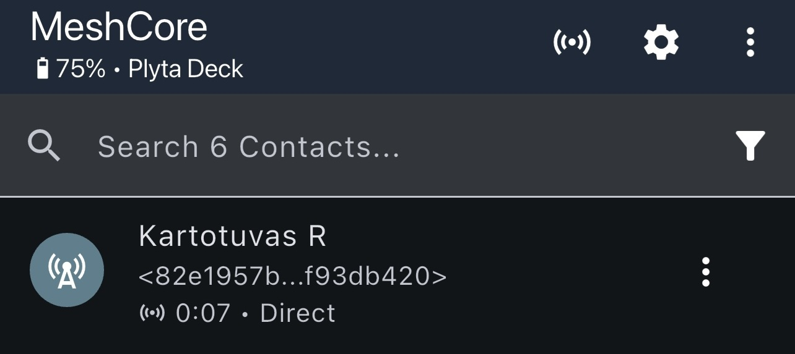
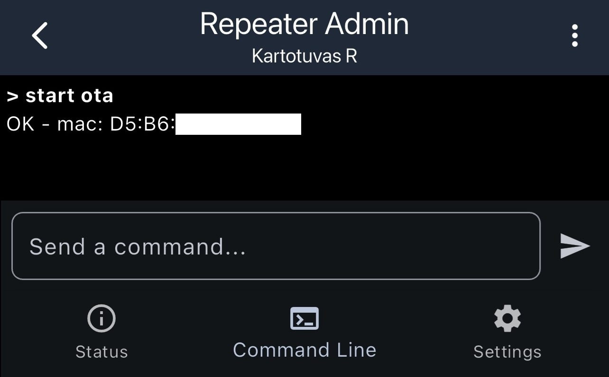
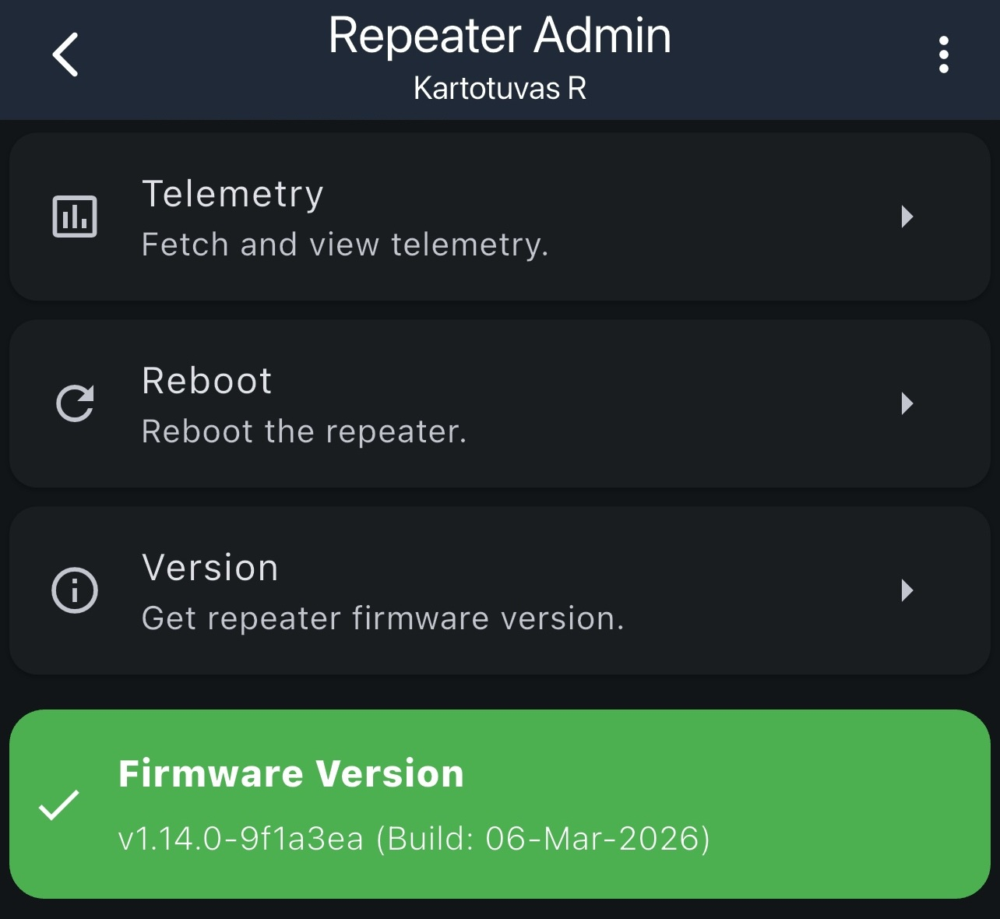

Šis puslapis skirtas nRF pagrindu veikiantiems įrenginiams, pvz. `RAK`, `Heltec T114` ir `Seeed XIAO`, kai norite atnaujinti programinę įrangą per `Bluetooth`.

## Trumpai

1. Pasirinktinai: atnaujinkite įrenginio bootloaderį, Žr. [Bootloader atnaujinimas (OTA fix)](#bootloader-atnaujinimas-ota-fix).
2. Įjunkite OTA režimą. Žr. [OTA režimo įjungimas per MeshCore](#ota-rezimo-ijungimas-per-meshcore).
3. Įkelkite naują programinę įrangą per Bluetooth. Žr. [Programinės įrangos įkėlimas per nRF DFU](#programines-irangos-ikelimas-per-nrf-dfu).

## Ko reikės

- Telefono su `iOS` arba `Android`
- Programėlės `MeshCore` ir `nRF Device Firmware Update`
- Tinkamo jūsų įrenginiui firmware failo `ZIP` formatu

Firmware atsisiųskite iš [flasher.meshcore.co.uk](https://flasher.meshcore.co.uk) pasirinkdami būtent `ZIP` versiją savo įrenginiui.

## Bootloader atnaujinimas (OTA fix)

Rekomenduojama atnaujinti bootloaderį su papildomais pataisymais kurie gali padidinti šansą sėkmingai atlikti atnaujinimą.

1. Atidarykite [github oltaco/Adafruit_nRF52_Bootloader_OTAFIX](https://github.com/oltaco/Adafruit_nRF52_Bootloader_OTAFIX/releases)
2. Atsiųskite teisingą firmware failą savo įrenginiui.
    - `.zip` - atnaujinimas naudojant `nRF DFU` programėlę
    - `.uf2` - atnaujinimas įkeliant per USB prisijungimą
3. Įjunkite OTA rėžimą arba du kartus spustelėkite `RESET` mygtuką ir įtempkite 

## OTA režimo įjungimas per MeshCore

Prieš įkeliant naują firmware reikia perjungti kartotuvą į OTA režimą. Tai galima padaryti per mobiliąją programėlę `MeshCore`: [iOS](https://apps.apple.com/us/app/meshcore/id6742354151) / [Android](https://play.google.com/store/apps/details?id=com.liamcottle.meshcore.android).

1. Programėlėje pasirinkite kartotuvą iš kontaktų sąrašo ir prisijunkite kaip administratorius.

2. Atidarykite `Command Line` skirtuką.
3. Įveskite komandą `start ota` ir paspauskite `Enter`.
4. Jei viskas pavyko, pamatysite atsakymą `OK`, o įrenginys pereis į OTA režimą. Ekrane gali būti parodytas ir Bluetooth MAC adresas.

Jei įrenginio vėliau nematote `nRF DFU` programėlėje, pabandykite dar kartą įjungti OTA režimą.

## Programinės įrangos įkėlimas per nRF DFU

Firmware įkėlimui naudokite oficialią programėlę `nRF Device Firmware Update`: [iOS](https://apps.apple.com/us/app/nrf-device-firmware-update/id1624454660) / [Android](https://play.google.com/store/apps/details?id=no.nordicsemi.android.dfu&hl=en).

1. Atsidarykite `nRF Device Firmware Update` programėlę.
2. Viršuje dešinėje atsidarykite `Settings`.
3. Įjunkite `Packet receipt notifications`.
4. Lauke `Number of Packets` nustatykite:
   - `10` jei naudojate `RAK`
   - `8` jei naudojate `Heltec T114`
   - `8` taip pat dažniausiai tinka ir `RAK`
5. Pasirinkite anksčiau atsisiųstą firmware `ZIP` failą.
6. Pasirinkite įrenginį, kurį norite atnaujinti.
7. Jei įrenginio sąraše nėra, dar kartą įjunkite OTA režimą per `MeshCore`.
8. Jei vis tiek nerandate, įjunkite `Force Scanning`.
9. Paspauskite `Upload` ir pradėkite atnaujinimą.
10. Palaukite, kol atnaujinimas baigsis. Tai gali užtrukti kelias minutes.

## Jei atnaujinimas nepavyksta

- Išjunkite ir vėl įjunkite telefono `Bluetooth`
- Dar kartą paleiskite įrenginį į OTA režimą su `start ota`
- `nRF DFU` programėlėje įjunkite `Force Scanning`
