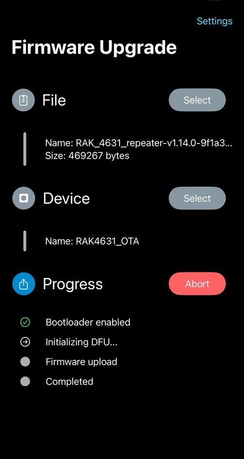
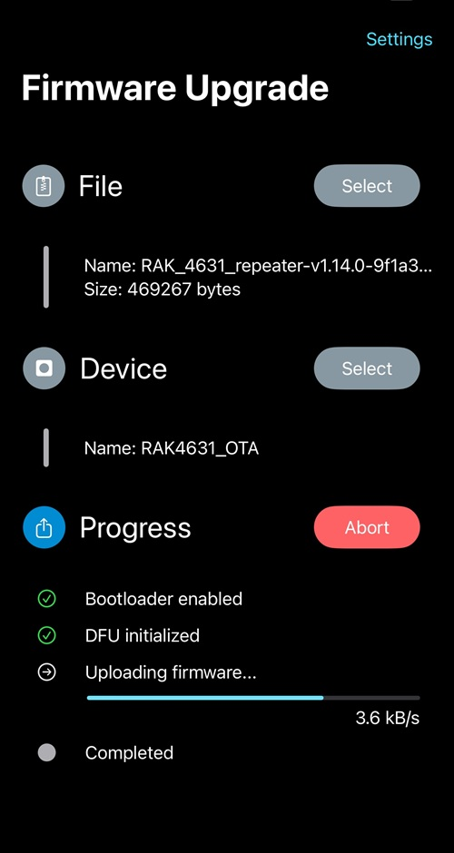
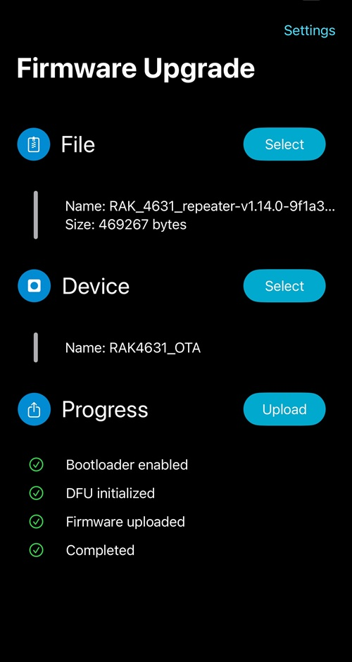
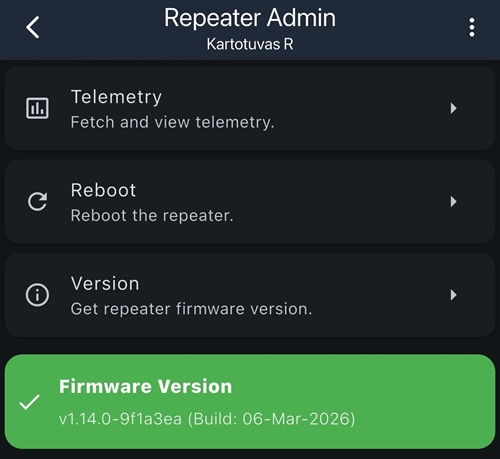

<Callout title="Dėmesio!" type="warning">
    Toks įrenginio atnaujinimo būdas yra nepatikimas ir gali sugadinti programinę įrangą, todėl įrenginys gali tapti nebeveikiantis.
Jei belaidis atnaujinimas nepavyktų, įsitikinkite, kad turite fizinę prieigą prie įrenginio.
</Callout>

<include>./_dalys/nrf52-bootloader-fix.mdx</include>
<include>./_dalys/ota-ijungimas.mdx</include>

## Programinės įrangos įkėlimas per nRF DFU

Firmware įkėlimui naudokite oficialią programėlę `nRF Device Firmware Update`: [iOS](https://apps.apple.com/us/app/nrf-device-firmware-update/id1624454660) / [Android](https://play.google.com/store/apps/details?id=no.nordicsemi.android.dfu&hl=en).

1. Atsidarykite `nRF Device Firmware Update` programėlę.
2. Viršuje dešinėje atsidarykite `Settings`.
3. Įjunkite `Packet receipt notifications`.
4. Lauke `Number of Packets` nustatykite:
   - `10` jei naudojate `RAK`
   - `8` jei naudojate `Heltec T114`
5. Pasirinkite anksčiau atsisiųstą firmware `ZIP` failą.
6. Pasirinkite įrenginį, kurį norite atnaujinti. Bluetooth pavadinimas bus su `AdaDFU` tekstu arba jeigu padarėte [bootloader fix](#bootloader-atnaujinimas-ota-fix) pagal įrenginį:
    - `Heltec T114` → `T114_DFU`
    - `ProMicro NRF52840` → `PROM_DFU`
    - `T1000e` → `T1KE_DFU`
    - `WioTracker L1` → `WTL1_DFU`
    - `RAK 4631` → `4631_DFU`
    - `RAK WisMesh Tag` → `RTAG_DFU`
    - `XIAO NRF52 / BLE Sense` → `XIAO_DFU`
7. Jei įrenginio sąraše nėra, dar kartą įjunkite OTA režimą.
8. Jei vis tiek nerandate, įjunkite `Force Scanning` nustatymuose.
9. Paspauskite `Upload` ir pradėkite atnaujinimą.
10. Palaukite, kol atnaujinimas baigsis. Tai gali užtrukti kelias minutes.

<Carousel>
  <CarouselContent>
    <CarouselItem className="basis-1/3">
        
    </CarouselItem>
    <CarouselItem className="basis-1/3">
        
    </CarouselItem>
    <CarouselItem className="basis-1/3">
        
    </CarouselItem>
  </CarouselContent>
  <CarouselPrevious />
<CarouselNext />
</Carousel>

Patikrinkite ar įrenginys buvo sėkmingai atnaujintas. Dar kartą prisijunkite kaip administratorius prie kartotuvo ir patikrinkite versiją (`Settings → Version`).

## Jei atnaujinimas nepavyksta

- Išjunkite ir vėl įjunkite telefono `Bluetooth`
- Dar kartą paleiskite įrenginį į OTA režimą su `start ota`
- `nRF DFU` programėlėje įjunkite `Force Scanning`
