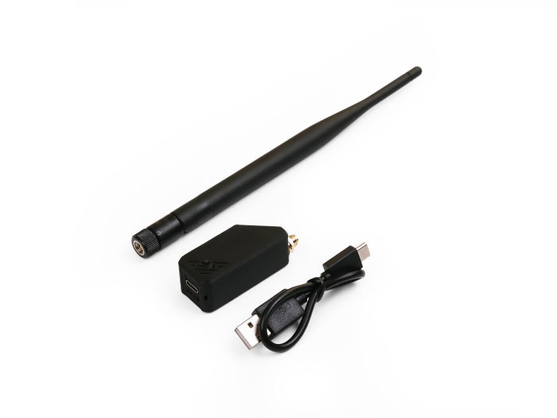
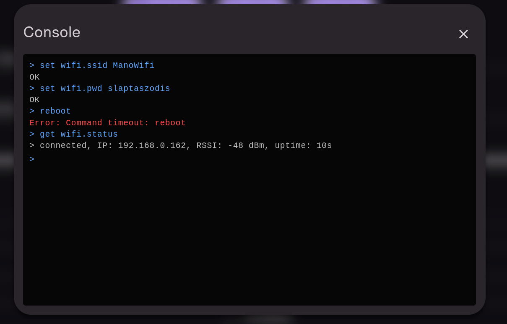
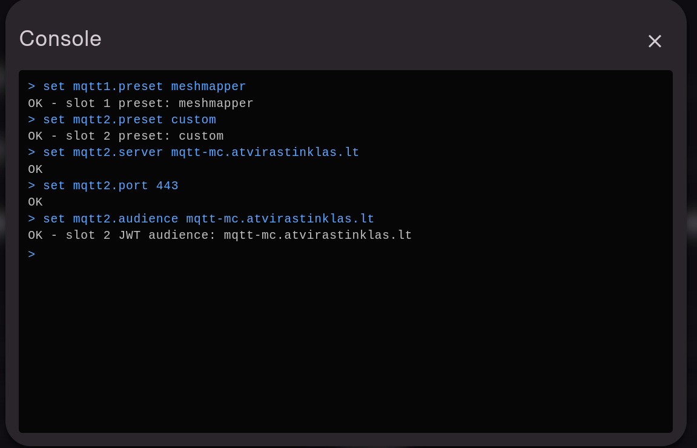
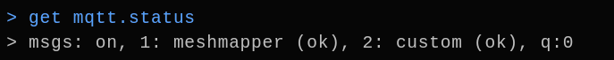
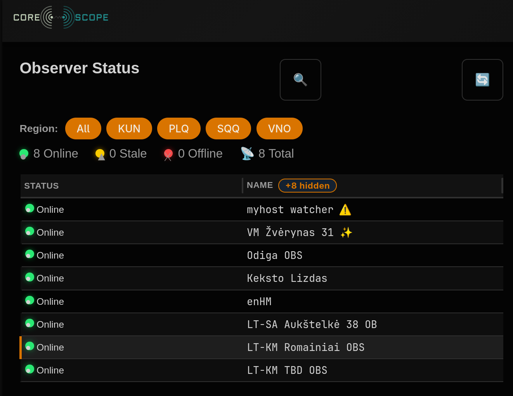

import { Step, Steps } from 'fumadocs-ui/components/steps';

## Pasiruošimas
- ESP32 įrenginys (Pvz.: [Xiao S3 WIO](https://www.seeedstudio.com/XIAO-ESP32S3-for-Meshtastic-LoRa-with-3D-Printed-Enclosure-p-6314.html))
- Maitinimo šaltinis
- WiFi tinklas su internetu
- Tinkama vieta įrenginiui kuris girdėtu bent vieną retransliatorių
- Prisijungimo prie mazgo per USB arba per kompanioną



## Nuorodos

- [MeshCore Observer įrašymo įrankis](https://observer.gessaman.com/)
- [Observer programinės įrangos dokumentacija](https://observer.gessaman.com/docs.html)

<Steps>
<Step>
### Įrašymas programinės įrangos

Oficiali programinė įranga neturi stebėjimo funkcijų. Tam buvo sukurta modifikuota programinė įranga - prieiga prie interneto ir MQTT brokerio. 
Įrašymui skirtas įrankis: [MeshCore Observer Flasher](https://observer.gessaman.com/)

Rekomenduojama pasirinkti `Room Server` rolę. Stebėjimo mazgas turi būti pasyvus tinklo dalyvis.

</Step>
<Step>
### Radijo nustatymai (po švaraus įrašymo)

Šį žingsnį atlikite po švaraus įrašymo. Nustatomas radijo profilis (`EU/UK (Narrow), Switzerland`) ir siuntimo galia.

```
set radio 869.6179809,62.5,8,8
set tx 22
```

</Step>
<Step>
### Įrenginio ID

Įrenginio vardą rekomenduojama nustatyti kaip retransliatoriaus su sufiksu OBS. Pavyzdžiui: `LT-KM Aleksotas OBS`. 

[Regiono kodą](./regionai) (IATA) pasirinkti vieną iš galimų: `VNO`, `KUN`, `SQQ`, `PLQ`.

```
set name <vardas>
set mqtt.iata <iata>
```

Jeigu migruojama iš kito įrenginio, galite nustatyti jo privatų raktą:
```
set prv.key <privatus raktas>
```

</Step>
<Step>
### Prisijungimas prie interneto

```
set wifi.ssid <ssid>
set wifi.pwd <slaptažodis>
reboot
```

Perkrovus įrenginį galite pasitikrinti wifi statusą:
```
get wifi.status
```



</Step>
<Step>
### Prisijungimas prie MQTT brokerio

Stebėjimo mazgo programinė įranga leidžia prisijungti prie 6 MQTT brokerių. Pirmos 2 vietos yra automatiškai nustatytos prisijungti prie LetsMesh MQTT brokerio. LetsMesh įrankis nebėra palaikomas, todėl mes naudojame savo MQTT brokerį ir MeshMapper kaip papildomą.

```
# MeshMapper MQTT brokeris
set mqtt1.preset meshmapper
# Atviras Tinklas MQTT brokeris
set mqtt2.preset custom
set mqtt2.server mqtt-mc.atvirastinklas.lt
set mqtt2.port 443
set mqtt2.audience mqtt-mc.atvirastinklas.lt
```

Pasitikrinti ar veikia MQTT prisijungimas:

```
get mqtt.status
```




</Step>
<Step>
### CoreScope patikrinimas

Prisijungus prie Atviro Tinklo MQTT brokerio, galite patikrinti ar stebėtojas yra [stebėtojų sąraše](https://meshcore.atvirastinklas.lt/#/observers):



</Step>
</Steps>
